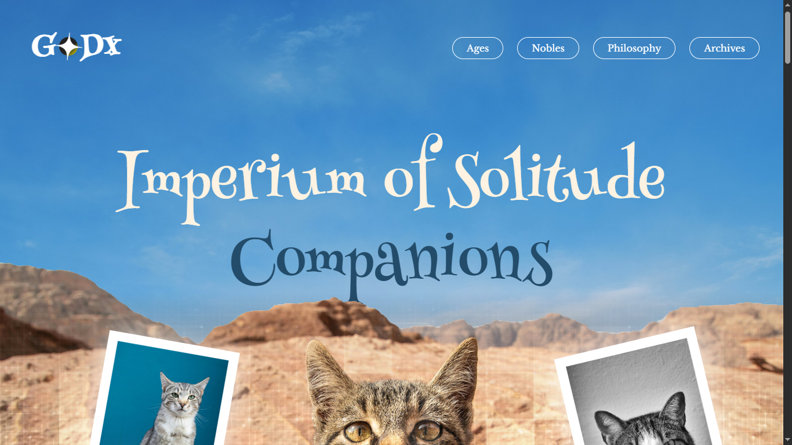
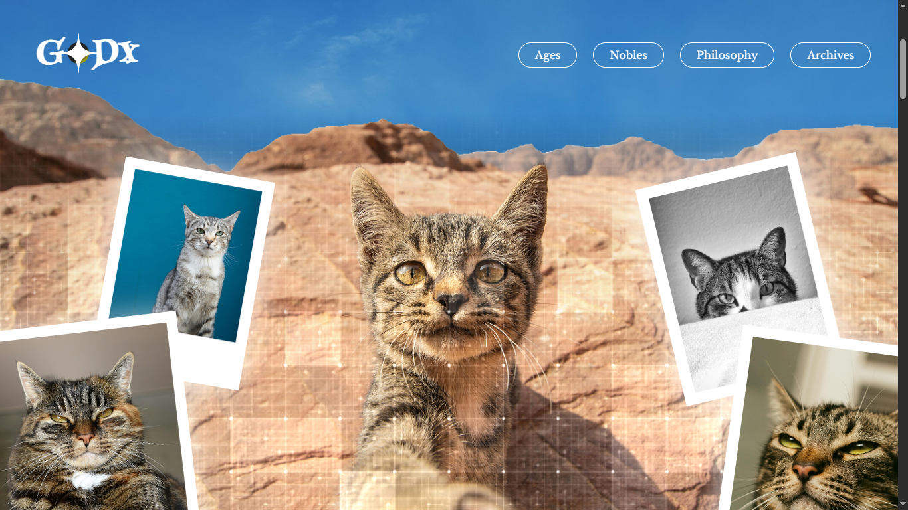
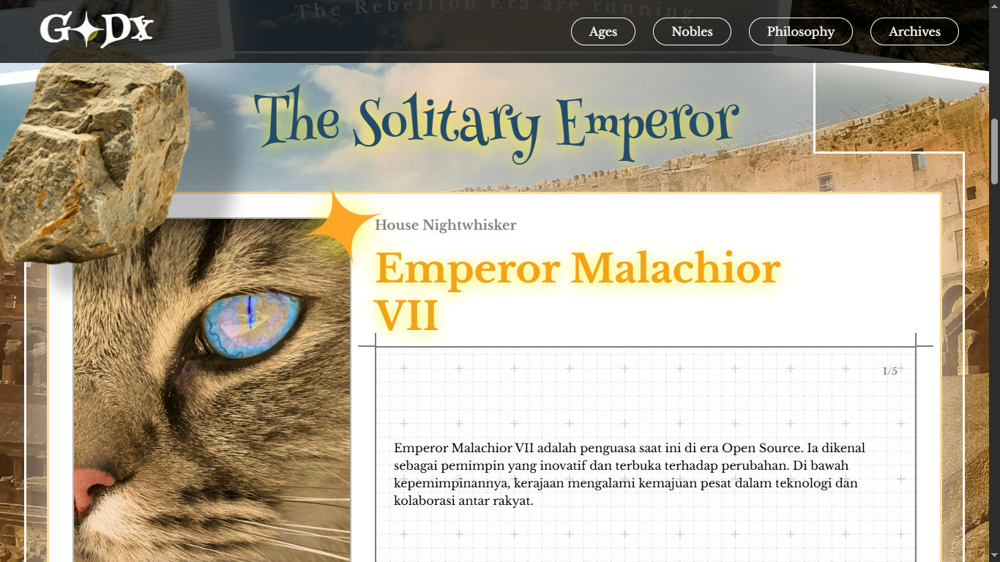
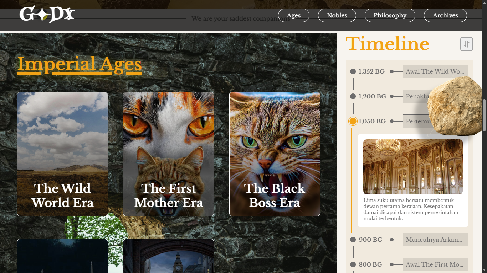
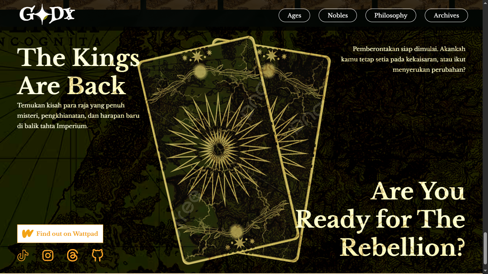

# GODX Dicoding Project 

Live demo: https://bayufadayan.github.io/godx-landing-page/

Deskripsi singkat
- Project ini adalah sebuah tampilan web sederhana untuk kursus Dicoding — berisi halaman beranda, help center, privacy policy, dan terms.

Cara melihat
- Buka file `index.html` di browser, atau lihat versi ter-publish di GitHub Pages: https://bayufadayan.github.io/godx-dicoding-project/

Screenshot

Berikut beberapa screenshot dari project (dari folder assets/screenshots):

Struktur singkat

- `index.html` - halaman utama
- `help-center.html` - halaman bantuan
- `privacy-policy.html` - kebijakan privasi
- `term-and-condition.html` - syarat dan ketentuan
- `script.js`, `style.css`, `style-another-page.css` - assets frontend
- `assets/` - gambar, icon, screenshot

Lisensi & Kredit
- Dikembangkan sebagai tugas latihan untuk Dicoding.
